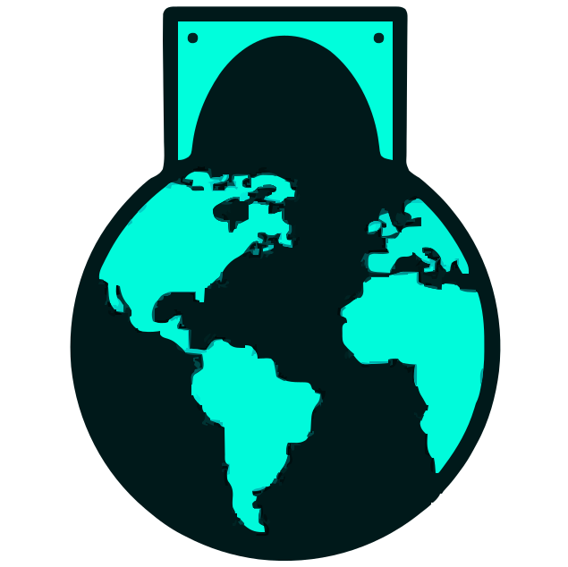

# EDHGlobe Roadmap

## To-do list
 
- Tournaments without coordinates (online events) are skipped right now. My idea is to have a separate list that is somehow accessible (thinking about adding the moon and be clickable lol).
- (doing) Based on this I want to add local/regional meta information of what is being played where. This was the original idea, but I needed the rest of the page first. This might be a bit hard to do still, since I've noticed localization issues for the same location, like, for example, calling *Catalunya*, *Catalonia*. These are the same exact location but with different names.
- Still researching for other cEDH platforms where tournaments are organized, to see if we can also add that data. These are the ones I'm currently looking at;
  - **Shuffleup** -> Still in beta, no API documentation visible, it looks complicated.
  - **God of commander** -> Japanese cEDH tournament from Hareruya. It's really difficult to actually get the information.
- Possibly add the option to view the ***future*** oncoming tournaments, displaying location, link, spots occupied and totally available and maybe even price as well as their topdeck.gg link?
- Add accesibility settings & manual keyboard shortcuts + visual menu of them.

★ Extra ★

- Set I'd like to add some sort of way to manual review all data, but that seems like a later-me-problem.
- *In a perfect world where I am either bored or there are no other priorities in this development I might start adding both easter eggs mtg-related in the world view or the background. **Hopefully**.*
- Decklist view - This is something really not needed, topdeck already provides a list visualization of the decklist, but it'd be cool to have all the information on the same page, so hopefully this will be implemented at some point in time.

Done

- Set the initial view to the middle of the Atlantic, between Spain and the US.
- From the tournament list view when selecting a bubble;
  - Add order when showing a list of tournaments that lets you also order by number of players. Default will always be from the most recent to the oldest.~~
  - Change the name of the title to better suit the bubble you clicked. Right now it's just printing one of the locations if you are zoomed out. Then move the number of tournaments below that title in a smaller font.~~ *(can be improved)*
  - Clicking on an empty space on the map (or the stars background) should close the tournament listing.
  - Add a small color next to the tournament indicating the tiers of each tournament. This will be based of the topdeck invitational, but it's not just for the tournaments within the invitational, it will also mark tournaments outside. This will also be added to the most recent "big" tournaments later on;
    - Bronze -> +16 players
    - Silver -> +30 players
    - Gold -> +50 players
    - Platinum -> +100 players
    - Diamond -> +250 players
- Right now, you can not zoom in while having your cursor on top of a Bubbgle, this should be fixed.
- Center off number of tournaments shown.
- Add Privacy policy.
- Add open/close menus animations
- Add viewable "Last updated data timestamp"
- Modify phone view *(not that important since most playerbase will take a look at this from a pc)*
- Add +16 players filter.
- Add color selector to change main color for another neon-like preset.
- Fixed data fetching - This has taken more time than I thought it would take at first honestly
- Add auto-updateable versioning (this will help track when things break). Format -> `v[YEAR].[MONTH].[NUMBER]` 
- Add a "featured tournaments", manually featuring a couple of relevant tournaments that might take place in the future (these should be added manually).
- Add a "most recent tournaments" button next to the number of tournaments shown. This should be filtered with the number of players selected and should show the most recent 20 tournaments.

# 
 
### **
 [EDHGlobe.com](https://edhglobe.com/) 
**

  
